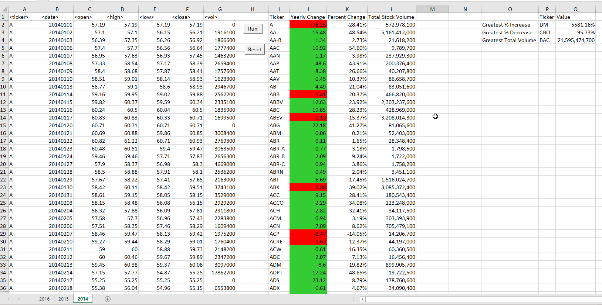

# VBA Scripting
VBA scripting is used to analyze real stock market data. 

## Introduction
VBA scripting is used to analyze real stock market data. 
The script willloop through all the stocks for one year and output the following information:

* The ticker symbol.

* Yearly change from opening price at the beginning of a given year to the closing price at the end of that year.

* The percent change from opening price at the beginning of a given year to the closing price at the end of that year.

* The total stock volume of the stock.

#Mainscript
The MainScript has the code plus the first challenge (summary of Greatest % Increase, Greatest % Decrease, Greatest Total Volume)
for each year. It also contains a sub-routine to reset all results in a sheet.

The Stocks_Challenge Script runs the calculations for all sheets in the dataset. It also contains a sub-routine to reset all results in all sheets.

All files can be found at: https://drive.google.com/drive/folders/1NhvINKJKYaIOSkglvFpAMufPzELju91k

Languages: Excel VBA

